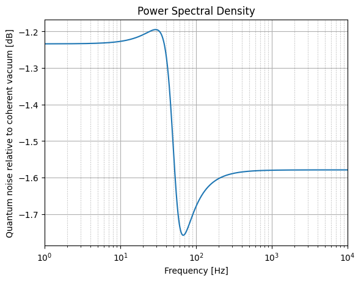

# gwinc

Gravitational Wave Interferometer Noise Calculator

| *Build Status* | *Documentation* |
|:--------------:|:-----------:|
| [![ci badge]][ci link]<br>[![codecov badge]][codecov link]<br>[![doc badge]][doc link]<br>[![pages badge]][pages link] | [![website badge]][website link] |

[doc badge]: https://github.com/jrunkening/gwinc/actions/workflows/Docs.yml/badge.svg
[doc link]: https://github.com/jrunkening/gwinc/actions/workflows/Docs.yml

[pages badge]: https://github.com/jrunkening/gwinc/actions/workflows/pages/pages-build-deployment/badge.svg
[pages link]: https://github.com/jrunkening/gwinc/actions/workflows/pages/pages-build-deployment

[ci badge]: https://github.com/jrunkening/gwinc/actions/workflows/CI.yml/badge.svg
[ci link]: https://github.com/jrunkening/gwinc/actions/workflows/CI.yml

[codecov badge]: https://codecov.io/gh/jrunkening/gwinc/branch/main/graph/badge.svg?token=ZBQBG3LQ49
[codecov link]: https://codecov.io/gh/jrunkening/gwinc
[codecov graph]: https://codecov.io/gh/jrunkening/gwinc/branch/main/graphs/sunburst.svg?token=ZBQBG3LQ49

[website badge]: https://img.shields.io/website?color=blue&url=https%3A%2F%2Fjrunkening.github.io%2Fgwinc%2F
[website link]: https://jrunkening.github.io/gwinc/

## Installation

This project is managed via `poetry` and can be easily installed via `pip`:

```sh
pip install git+https://github.com/jrunkening/gwinc.git
```

If you are using `poetry`, run the following cmd instead:

```sh
poetry add git+https://github.com/jrunkening/gwinc.git
```

## Quick start

This project is implemented to simulate the power spectral density of quantum noise in signal quadrature.

```python
transfer_matrix = build_transfer_matrix([
    Squeezer(
        squeezing_factor = 10,
        squeezing_angle = 0,
        squared_injection_loss = 0.32
    ),
    FilterCavity(
        squared_input_mirror_transmission = 0.00136,
        squared_round_trip_loss = 120e-6,
        filter_cavity_length = 300,
        carrier_wavelength = 1064,
        detuning = 0.1,
        filter_cavity_length_error = 0,
        sum_of_all_squeezed_filter_cavity_higher_order_mode_coupling_coefficients = 0.06,
        sum_of_all_squeezed_local_oscillator_higher_order_mode_coupling_coefficients = 0.02,
        mode_mismatch_phase_ambiguity = 2*np.pi
    ),
    Readout(
        squared_readout_loss = 0.06
    )
])

noise = build_noise(
    transfer_matrix = transfer_matrix,
    measurement_amplitude = 1,
    measurement_phase = 0.1 * np.pi/180
)
```



## Example

The example of simulate the noise curve can be found [here](https://github.com/jrunkening/gwinc/blob/main/notebook/demo.ipynb).
